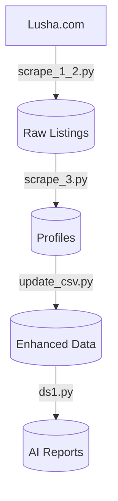

# Oil & Gas Company Scraper and Analyzer


A comprehensive pipeline for scraping, processing, and analyzing oil and gas companies across the Middle East, featuring AI-powered country report generation.

## 🏗️ Project Structure

### 📜 Core Scripts

#### 1. `scrape_1_2.py` - Initial Scraper
```python
# Example snippet:
country_map = {
    "埃及": "egypt",
    "伊朗": "iran-islamic-republic-of",
    # ...15 countries
}
```
- **Input**: Lusha.com search results
- **Output**: `selenium_oil_gas.csv`
- **Features**:
  - Headless Chrome browsing
  - Bilingual country mapping
  - Smart pagination handling
  - Anti-detection delays

#### 2. `scrape_3.py` - Profile Extractor
```python
# Example progress tracking:
print(f"[{processed}/{total}] {comp_name} → elapsed: {elapsed:.1f}s, ETA: {eta:.1f}s")
```
- **Input**: Company URLs
- **Output**: `company_profiles.csv`
- **Features**:
  - JSON-LD schema extraction
  - Real-time progress metrics
  - Organization data parsing

#### 3. `update_csv.py` - Data Enhancer
```python
# Example column cleaning:
df = df.drop(columns=['公司链接'], errors='ignore')
```
- **Input**: Raw profiles
- **Output**: Enhanced `company_profiles_cleaned.csv`
- **Features**:
  - Missing data detection
  - URL standardization
  - Column optimization

#### 4. `ds1.py` - Report Generator
```python
# Example AI prompt:
SYSTEM_CONTENT = \"\"\"你是一个擅长做行业分析和生成结构化 JSON 报告的智能助手...\"\"\"
```
- **Input**: Cleaned profiles
- **Output**: Country-specific JSON reports
- **Features**:
  - Token-aware processing
  - Bilingual analysis
  - Structured output

## 📂 Data Files

| File | Description |
|------|-------------|
| `selenium_oil_gas.csv` | Raw company listings with URLs |
| `company_profiles.csv` | Initial scraped profiles |
| `company_profiles_cleaned.csv` | Final enhanced dataset |
| `[Country].json` | AI-generated analysis reports |

## 🔧 Technical Implementation

### 🛠️ Key Technologies

| Technology | Purpose |
|------------|---------|
| Selenium | Web scraping automation |
| Pandas | Data transformation |
| JSON-LD | Structured data extraction |
| DeepSeek API | AI analysis |
| tiktoken | Context management |

### 🔄 Data Pipeline



## 🚀 Getting Started

### Prerequisites

1. **System Requirements**:
   - Python 3.8+
   - Chrome browser
   - ChromeDriver (matching your Chrome version)

2. **Install Packages**:
   ```bash
   pip install -r requirements.txt
   ```
   (or manually install selenium, pandas, tiktoken, openai)

3. **API Setup**:
   ```bash
   export DEEP_SEEK_API="your_api_key_here"
   ```

### Execution Flow

1. **First Run**:
   ```bash
   python scrape_1_2.py && python scrape_3.py
   ```

2. **Enhance Data**:
   ```bash
   python update_csv.py
   ```

3. **Generate Reports**:
   ```bash
   python ds1.py
   ```

## ⚙️ Configuration Examples

### Anti-Blocking Setup
```python
options = Options()
options.add_argument("--headless")
options.add_argument("--disable-gpu")
options.add_argument("user-agent=Mozilla/5.0...")
```

### AI Report Template
```json
{
  "final_report": {
    "公司总数": 120,
    "1_公司主要业务": {
      "勘探开发": ["National Oil Co", "Desert Energy"],
      "炼油化工": ["Gulf Refinery"]
    },
    "4_行业分析": {
      "技术特点": "中东地区普遍采用...",
      "发展趋势": [
        "可再生能源整合",
        "数字化油田技术"
      ]
    }
  }
}
```

## 🧠 Analysis Features

1. **Business Segmentation**
   - Upstream/Midstream/Downstream mapping
   - Service provider identification

2. **Regional Analysis**
   - Cross-border relationships
   - Market concentration

3. **Technical Insights**
   - Emerging technologies
   - Investment trends

4. **Strategic Evaluation**
   - Competitive landscape
   - Growth opportunities

## 🛠️ Customization Guide

### Modify Target Countries
1. Edit `country_map` in `scrape_1_2.py`
   ```python
   country_map = {
       "New Country": "new-country-slug",
       # ...existing mappings
   }
   ```

2. Update report focus in `ds1.py`:
   ```python
   SYSTEM_CONTENT = \"\"\"...new analysis requirements...\"\"\"
   ```

## 🐛 Troubleshooting

| Issue | Solution |
|-------|----------|
| ChromeDriver errors | Ensure version matches Chrome (check `chrome://version`) |
| Missing profiles | Increase `WebDriverWait` timeout in `scrape_3.py` |
| API failures | Verify environment variable: `echo $DEEP_SEEK_API` |
| Encoding problems | Use UTF-8-SIG for all CSV operations |

## 📈 Example Output

**Saudi_Arabia.json**:
```json
{
  "0": {
    "公司总数": 18,
    "1_公司主要业务": {
      "勘探与生产": [
        "Delek Group",
        "Modiin Energy",
        "Navitas Petroleum",
        "NewMed Energy"
      ],
      "炼油与石化": [
        "BAZAN Group Oil Refineries Ltd",
        "Paz Oil Company"
      ],
      "原油运输与存储": [
        "EAPC"
      ],
      "加油站与零售分销": [
        "Delek",
        "Paz Oil Company",
        "Sonol - סונול"
      ],
      "技术服务与解决方案": [
        "4IR Solutions",
        "GII - Geophysical Institute of Israel",
        "Geomage",
        "Orpak Systems",
        "Roseman Engineering",
        "Pexgol"
      ],
      "能源咨询": [
        "DDL Consulting & PM Ltd."
      ],
      "环保技术": [
        "HARBO Technologies Ltd"
      ],
      "其他领域": [
        "Mifram Agencies Ltd"
      ]
    },
    "2_细分领域覆盖": {
      "上游": [
        "Delek Group",
        "Modiin Energy",
        "Navitas Petroleum",
        "NewMed Energy",
        "DDL Consulting & PM Ltd.",
        "GII - Geophysical Institute of Israel",
        "Geomage"
      ],
      "中游": [
        "BAZAN Group Oil Refineries Ltd",
        "Paz Oil Company",
        "EAPC",
        "Pexgol",
        "4IR Solutions",
        "HARBO Technologies Ltd"
      ],
      "下游": [
        "Delek",
        "Paz Oil Company",
        "Sonol - סונול",
        "Orpak Systems",
        "Roseman Engineering"
      ]
    },
    "3_与周边国家的商业往来": {
      "美国": {
        "提及公司数量": 3,
        "公司": [
          "Delek Group",
          "Modiin Energy",
          "Navitas Petroleum"
        ]
      },
      "地中海地区": {
        "提及公司数量": 1,
        "公司": [
          "BAZAN Group Oil Refineries Ltd"
        ]
      },
      "全球多国": {
        "提及公司数量": 1,
        "公司": [
          "Orpak Systems"
        ]
      }
    },
    "4_行业分析": {
      "行业结构": "以色列石油和天然气行业呈现垂直整合结构，涵盖上游勘探与生产（如Delek Group和NewMed Energy在东地中海气田开发）、中游炼油与运输（如BAZAN Group和EAPC的管道系统）、以及下游零售分销（如Paz Oil Company和Sonol的加油站网络）。行业由少数大型企业主导，如Paz和BAZAN，同时存在众多技术服务公司支持全链条。",
      "技术特点": "行业高度技术驱动，突出表现在：AI和实时分析优化（4IR Solutions的石油分析仪）、先进地球物理勘探（GII和Geomage的地震处理技术）、数字化解决方案（Orpak Systems和Roseman Engineering的零售和车队管理系统）、以及环保创新（HARBO Technologies的漏油控制）。技术融合提升效率和安全性，如炼油过程优化和可再生能源整合。",
      "市场分布": "市场以本地消费为主，例如BAZAN Group 70%产品内销；同时具有显著出口导向，出口至地中海地区、美国和全球。下游零售网络密集，覆盖全国加油站（如Delek、Paz和Sonol运营超500个站点）。上游资源集中于东地中海盆地，中游设施如Haifa和Ashdod炼油厂支撑区域供应。",
      "发展趋势": [
        "向可再生能源转型，如NewMed Energy和Modiin Energy发展替代能源业务，响应全球减碳趋势。",
        "国际扩张加速，公司如Delek Group和Navitas Petroleum在北美和北海拓展项目，提升全球影响力。",
        "技术创新深化，整合AI、物联网和云计算（如Roseman Engineering的Azure方案），推动智能化和效率提升。",
        "垂直整合加强，大型企业如Paz Oil Company覆盖炼油、存储到零售，优化供应链。"
      ],
      "挑战与机遇": {
        "挑战": [
          "地缘政治风险，东地中海区域紧张影响勘探和出口稳定性。",
          "环境合规压力，漏油事故和碳排放监管增加运营成本，需依赖技术如HARBO解决方案。",
          "市场竞争加剧，本地零售饱和，国际巨头进入带来挑战。"
        ],
        "机遇": [
          "天然气出口枢纽建设，东地中海大型气田（如Leviathan）开发，定位以色列为区域能源中心。",
          "技术出口潜力，公司如Orpak Systems和GII的全球业务，提供增长机会。",
          "可再生能源转型，政策支持和企业投资（如NewMed Energy）开拓新市场。",
          "数字化升级，零售和车队管理方案需求上升，推动服务创新。"
        ]
      }
    },
    "5_重点公司分析": {
      "BAZAN Group Oil Refineries Ltd": {
        "地位": "以色列最大炼油和石化公司，主导国内供应，拥有Haifa炼油厂群。",
        "产能": "最大日产能26,600吨石油（约197,000桶），覆盖石油蒸馏产品和下游聚合物、芳烃等。"
      },
      "Paz Oil Company": {
        "地位": "以色列最大垂直能源集团，供应全国三分之一石油消费，整合炼油、存储和零售网络。",
        "产能": "拥有Ashdod炼油厂，存储容量大，运营280个加油站和185家便利店，支撑广泛分销。"
      },
      "Delek Group": {
        "地位": "领先独立勘探与生产公司，东地中海天然气开发先驱，推动区域出口枢纽建设。",
        "产能": "主要气田包括Leviathan（21.4 TCF储量）和Tamar（11.2 TCF），支撑高产量出口。"
      },
      "NewMed Energy": {
        "地位": "转型后的关键天然气运营商，拓展替代能源业务，在Levant Basin有重大影响力。",
        "产能": "基于Leviathan等气田，产能规模化，支持天然气出口和新能源项目开发。"
      }
    },
    "6_总结": "以色列石油和天然气行业以18家公司为代表，展现出强大的垂直整合和技术创新力。上游勘探（如Delek Group和NewMed Energy）聚焦东地中海丰富资源，中游炼油和运输（BAZAN和EAPC）支撑区域供应，下游零售网络（Paz和Sonol）覆盖全国。行业面临地缘政治和环境挑战，但凭借技术优势（如AI和数字化解决方案）和出口机遇（特别是天然气和全球技术服务），正积极向可再生能源转型和国际市场扩张，未来发展潜力显著。"
  }
}
```

## 📜 License

This project is licensed under the MIT License - see the [LICENSE](LICENSE) file for details.

