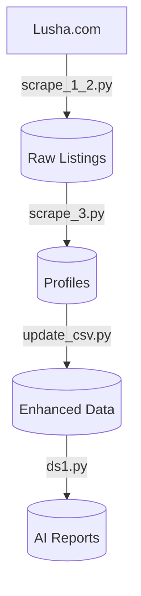

# Oil & Gas Company Scraper and Analyzer


A comprehensive pipeline for scraping, processing, and analyzing oil and gas companies across the Middle East, featuring AI-powered country report generation.

## 🏗️ Project Structure

### 📜 Core Scripts

#### 1. `scrape_1_2.py` - Initial Scraper
```python
# Example snippet:
country_map = {
    "埃及": "egypt",
    "伊朗": "iran-islamic-republic-of",
    # ...15 countries
}
```
- **Input**: Lusha.com search results
- **Output**: `selenium_oil_gas.csv`
- **Features**:
  - Headless Chrome browsing
  - Bilingual country mapping
  - Smart pagination handling
  - Anti-detection delays

#### 2. `scrape_3.py` - Profile Extractor
```python
# Example progress tracking:
print(f"[{processed}/{total}] {comp_name} → elapsed: {elapsed:.1f}s, ETA: {eta:.1f}s")
```
- **Input**: Company URLs
- **Output**: `company_profiles.csv`
- **Features**:
  - JSON-LD schema extraction
  - Real-time progress metrics
  - Organization data parsing

#### 3. `update_csv.py` - Data Enhancer
```python
# Example column cleaning:
df = df.drop(columns=['公司链接'], errors='ignore')
```
- **Input**: Raw profiles
- **Output**: Enhanced `company_profiles_cleaned.csv`
- **Features**:
  - Missing data detection
  - URL standardization
  - Column optimization

#### 4. `ds1.py` - Report Generator
```python
# Example AI prompt:
SYSTEM_CONTENT = \"\"\"你是一个擅长做行业分析和生成结构化 JSON 报告的智能助手...\"\"\"
```
- **Input**: Cleaned profiles
- **Output**: Country-specific JSON reports
- **Features**:
  - Token-aware processing
  - Bilingual analysis
  - Structured output

## 📂 Data Files

| File | Description |
|------|-------------|
| `selenium_oil_gas.csv` | Raw company listings with URLs |
| `company_profiles.csv` | Initial scraped profiles |
| `company_profiles_cleaned.csv` | Final enhanced dataset |
| `[Country].json` | AI-generated analysis reports |

## 🔧 Technical Implementation

### 🛠️ Key Technologies

| Technology | Purpose |
|------------|---------|
| Selenium | Web scraping automation |
| Pandas | Data transformation |
| JSON-LD | Structured data extraction |
| DeepSeek API | AI analysis |
| tiktoken | Context management |

### 🔄 Data Pipeline



## 🚀 Getting Started

### Prerequisites

1. **System Requirements**:
   - Python 3.8+
   - Chrome browser
   - ChromeDriver (matching your Chrome version)

2. **Install Packages**:
   ```bash
   pip install -r requirements.txt
   ```
   (or manually install selenium, pandas, tiktoken, openai)

3. **API Setup**:
   ```bash
   export DEEP_SEEK_API="your_api_key_here"
   ```

### Execution Flow

1. **First Run**:
   ```bash
   python scrape_1_2.py && python scrape_3.py
   ```

2. **Enhance Data**:
   ```bash
   python update_csv.py
   ```

3. **Generate Reports**:
   ```bash
   python ds1.py
   ```

## ⚙️ Configuration Examples

### Anti-Blocking Setup
```python
options = Options()
options.add_argument("--headless")
options.add_argument("--disable-gpu")
options.add_argument("user-agent=Mozilla/5.0...")
```

### AI Report Template
```json
{
  "final_report": {
    "公司总数": 120,
    "1_公司主要业务": {
      "勘探开发": ["National Oil Co", "Desert Energy"],
      "炼油化工": ["Gulf Refinery"]
    },
    "4_行业分析": {
      "技术特点": "中东地区普遍采用...",
      "发展趋势": [
        "可再生能源整合",
        "数字化油田技术"
      ]
    }
  }
}
```

## 🧠 Analysis Features

1. **Business Segmentation**
   - Upstream/Midstream/Downstream mapping
   - Service provider identification

2. **Regional Analysis**
   - Cross-border relationships
   - Market concentration

3. **Technical Insights**
   - Emerging technologies
   - Investment trends

4. **Strategic Evaluation**
   - Competitive landscape
   - Growth opportunities

## 🛠️ Customization Guide

### Modify Target Countries
1. Edit `country_map` in `scrape_1_2.py`
   ```python
   country_map = {
       "New Country": "new-country-slug",
       # ...existing mappings
   }
   ```

2. Update report focus in `ds1.py`:
   ```python
   SYSTEM_CONTENT = \"\"\"...new analysis requirements...\"\"\"
   ```

## 🐛 Troubleshooting

| Issue | Solution |
|-------|----------|
| ChromeDriver errors | Ensure version matches Chrome (check `chrome://version`) |
| Missing profiles | Increase `WebDriverWait` timeout in `scrape_3.py` |
| API failures | Verify environment variable: `echo $DEEP_SEEK_API` |
| Encoding problems | Use UTF-8-SIG for all CSV operations |

## 📈 Example Output

**Saudi_Arabia.json**:
```json
{
  "final_report": {
    "公司总数": 214,
    "2_细分领域覆盖": {
      "上游": ["Saudi Aramco", "Red Sea Drilling"],
      "中游": ["PetroPipeline Co"],
      "下游": ["Kingdom Refineries"]
    },
    "3_与周边国家的商业往来": {
      "阿联酋": {
        "提及公司数量": 28,
        "公司": ["Gulf Energy LLC", "Desert Petrochem"]
      }
    }
  }
}
```

## 📜 License

This project is licensed under the MIT License - see the [LICENSE](LICENSE) file for details.

